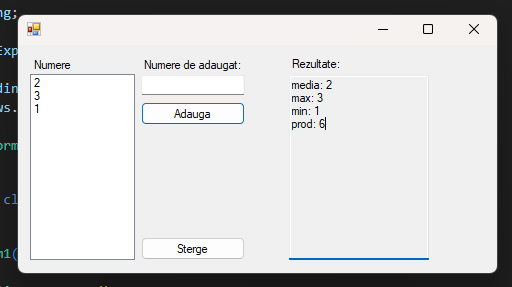

<b>Olla!</b>

 

All my mini-projects have their own standalone executable that can be found under any (projectname/bin/debug/projectname.exe)

<h1>Avrage-Min-Max-Multiply</h1>

<h1>Basic Calculator</h1>

<h1>Basic Notepad with tabs</h1>

<h1>Convert INT into String - RO</h1>

<h1>Local Contact Book</h1>

<h1>Transform strings from a file to upper case</h1>

